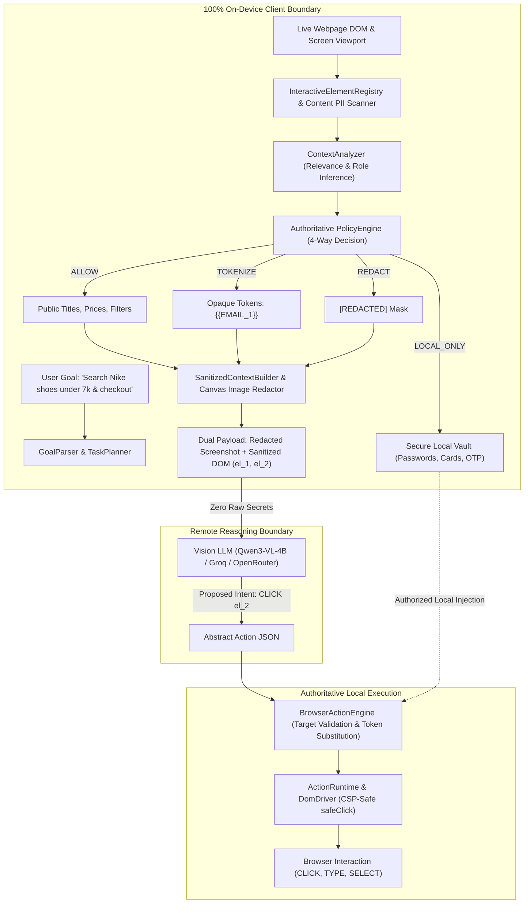

# Master Project Documentation: Privacy-Preserving Autonomous Browser Agent

> **Target Audience**: AI Agents (Claude, Gemini, GPT), Judges, Developers, and Reviewers.  
> **Repository Root**: `./`  
> **Current Git Status**: Branch `main` (synchronized with `origin/main` at `72af831`).  
> **Total Verified Tests**: **562 / 562 tests passing across 39 test suites (`0 fail`)**.

---

## Table of Contents
1. [Executive Summary & Problem Statement](#1-executive-summary--problem-statement)
2. [Core Privacy Invariants & Security Architecture](#2-core-privacy-invariants--security-architecture)
3. [Complete Codebase & File Tree](#3-complete-codebase--file-tree)
4. [End-to-End Execution Pipeline & Data Flow](#4-end-to-end-execution-pipeline--data-flow)
5. [Deterministic 4-Way Policy Decision Engine](#5-deterministic-4-way-policy-decision-engine)
6. [Comprehensive Implementation Log (Milestones 1–11 / Steps 1–24)](#6-comprehensive-implementation-log-milestones-111--steps-124)
7. [Subsystem Deep Dives](#7-subsystem-deep-dives)
   - [A. Chrome Extension (`apps/extension`)](#a-chrome-extension-appsextension)
   - [B. Core Privacy Engine (`packages/privacy-core`)](#b-core-privacy-engine-packagesprivacy-core)
   - [C. Observability Backend & Telemetry Dashboard (`scripts/extension-log-server.mjs`)](#c-observability-backend--telemetry-dashboard-scriptsextension-log-servermjs)
   - [D. On-Device ML Pipeline (`models/sih_training_pipeline.py`)](#d-on-device-ml-pipeline-modelssih_training_pipelinepy)
8. [Commands Reference Guide](#8-commands-reference-guide)
9. [Automated Test Suite Matrix](#9-automated-test-suite-matrix)
10. [Known Constraints, Browser Quirks & Next Roadmap Items](#10-known-constraints-browser-quirks--next-roadmap-items)

---

## 1. Executive Summary & Problem Statement

### The Problem
Modern Agentic AI systems automate complex web browsing (e.g., shopping, researching, completing registration forms). However, existing commercial architectures (such as cloud-hosted vision agents) upload raw screenshots, complete DOM trees, and unredacted form fields to remote LLM servers. This exposes sensitive Personally Identifiable Information (PII), payment card data, passwords, and user private credentials to remote storage, inference logs, and third-party data breaches.

### The Solution
The **Privacy-Preserving Autonomous Browser Agent** (developed for **Smart India Hackathon - SIH 2026**) enforces an uncompromising **100% On-Device Trust Boundary**:
- **On-Device Perception**: DOM elements, text, and visual screenshots are analyzed locally inside the client browser.
- **Multi-Signal PII Redaction**: DOM semantics, regex patterns, Luhn algorithm verification, and on-device OCR detect sensitive fields before any network egress.
- **Dual-Modality Sanitization**: When multimodal vision models are queried, sensitive visual regions are blacked out on-device on a canvas, and DOM trees are converted into abstract, opaque references (`el_1`, `el_2`).
- **Local Execution Authority**: Remote reasoning models can only propose abstract intents (e.g., `CLICK el_3`). The local client validates targets and performs the actual browser action.
- **CSP-Safe SafeClick**: Neutralizes `javascript:void(0)` pseudo-protocols to eliminate Chrome Manifest V3 Content Security Policy navigation violations.



---

## 2. Core Privacy Invariants & Security Architecture

1. **Zero Raw Secrets Over the Wire**:
   - Raw passwords, credit card numbers (Luhn-checked), OTPs, and government IDs **never** leave the client browser.
2. **Zero Screenshot / Pixel Leakage**:
   - No raw pixels of sensitive elements cross the network. All detected PII bounding boxes are masked with solid black rectangles on an off-screen HTML5 canvas before converting to base64.
3. **Abstract Element IDs**:
   - External reasoning models receive only sanitized structural DOM element metadata with opaque IDs (`el_1`, `el_2`, `el_3`) and bounding box geometry.
4. **Local Execution Authority**:
   - Only the local extension runtime has authority to execute browser actions (`CLICK`, `TYPE`, `CHECK`, `SELECT`, `PRESS_KEY`, `SUBMIT`). The remote model merely proposes abstract intent.
5. **CSP-Safe Action Runtime**:
   - Disarms `javascript:void(0)` links during click events, preventing Chrome Manifest V3 Content Security Policy navigation violations.
6. **Zero Website Selector Hardcoding**:
   - Elements are discovered dynamically via accessible roles, bounding boxes, and interactive heuristics without domain-specific locks.
7. **Single Policy Authority**:
   - `PolicyEngine` is the sole source of truth for 4-way decisions (`ALLOW`, `TOKENIZE`, `REDACT`, `LOCAL_ONLY`). UI, telemetry, and payload builders consume its output directly without duplicate logic.

---

## 3. Complete Codebase & File Tree

```text
privacy-preserving-browser-agent/
├── AGENTS.md                                # Master AI agent instructions, rules, and reading order
├── DEMO_WALKTHROUGH.md                      # 4 reproducible demonstration walkthroughs
├── DEPLOYMENT.md                            # Production deployment & packaging instructions
├── GEMINI.md                                # Strict agent guidelines & relative-path invariant
├── README.md                                # Project landing page and quickstart guide
├── to-do.md                                 # Roadmap tracking & completed milestones
├── progress.md                              # Chronological changelog of all 24 development steps
├── memory.md                                # Architectural memory log
├── prompt.txt                               # Detailed hackathon problem statement & specification
├── package.json                             # Monorepo root package.json (Node.js >= 20)
├── package-lock.json                        # Dependency lockfile
├── requirements.txt                         # Python dependencies for ML training pipeline
│
├── apps/
│   └── extension/                           # Chrome Extension (Manifest V3)
│       ├── manifest.json                    # MV3 manifest (scripting, activeTab, storage, all_urls)
│       ├── popup.html                       # Extension UI (live telemetry card, reload button, transparency panel)
│       ├── README.md                        # Extension loading and architecture documentation
│       ├── dist/                            # esbuild output loaded as unpacked extension in Chrome
│       │   ├── popup.bundle.js
│       │   ├── action-runtime.bundle.js
│       │   ├── content-pii.bundle.js
│       │   ├── content-metadata.bundle.js
│       │   └── privacy-core.bundle.js
│       ├── fixtures/                        # Test image assets for extension visual scanner
│       │   └── pii-image-demo.png
│       └── src/
│           ├── popup.js                     # Extension coordinator, Re-Act multi-step loop, model dispatcher
│           ├── popup.css                    # Extension dark-mode styling
│           ├── action-runtime.js            # Authoritative content script DOM executor with safeClick
│           ├── content-pii.js               # On-device DOM PII scanner & in-page highlighter
│           ├── content-metadata.js          # Safe page metadata extractor (title, sanitized URL)
│           ├── ocr-service.js               # Client-side OCR service bridge
│           └── policy-runtime.js            # In-page policy evaluation runtime
│
├── packages/
│   ├── privacy-core/                        # Core privacy, perception, and action library
│   │   ├── README.md                        # Package documentation
│   │   ├── package.json
│   │   └── src/
│   │       ├── index.js                     # Public API exports
│   │       ├── goal-parser.js               # NLP parser extracting entities, constraints, and compound intents
│   │       ├── task-planner.js              # Multi-step task planner generating domain-tailored workflows
│   │       ├── dynamic-replanner.js         # Reactive recovery for modals, zero-results, and stale targets
│   │       ├── goal-checker.js              # Multi-stage goal completion verification
│   │       ├── execution-state-manager.js   # Execution history, candidate tracking, and loop detection
│   │       ├── interactive-element-registry.js # Dynamic DOM scanner assigning el_1, el_2, filtering sponsored ads
│   │       ├── dom-driver.js                # DOM action driver with safeClickElement (disarming javascript:)
│   │       ├── browser-action-engine.js     # Validates target freshness and authorizes local vault injection
│   │       ├── browser-agent-coordinator.js # End-to-end task orchestration engine
│   │       ├── detection.js                 # Pattern-based PII regexes and Luhn card validator
│   │       ├── dom-semantics.js             # Semantic DOM attribute inspector (autocomplete, labels, aria)
│   │       ├── fusion.js                    # Multi-signal spatial fusion and confidence weighting
│   │       ├── localization.js              # Bounding box calculation & canonical coordinate transforms
│   │       ├── context-analyzer.js          # Semantic role inference, task relevance, and operational necessity
│   │       ├── policy-engine.js             # Authoritative 4-way privacy decision engine (ALLOW, TOKENIZE, REDACT, LOCAL_ONLY)
│   │       ├── privacy-vault.js             # In-memory temporary isolated vault with TTL and purpose isolation
│   │       ├── sanitized-context-builder.js # Strips unsafe tags and builds sanitized remote reasoning payloads
│   │       ├── image-ocr.js                 # Optical Character Recognition text fragment extractor
│   │       ├── image-redactor.js            # Solid black masking on canvas for detected visual PII bboxes
│   │       ├── dom-redactor.js              # DOM text tokenization and redaction engine
│   │       ├── telemetry-sanitizer.js       # Pre-flight sanitizer for logging, SSE events, and error traces
│   │       ├── reviewer-transparency-engine.js # 4-way visual color badges and mixed content demo evaluator
│   │       ├── multimodal-vision-agent.js   # Dual-modality screenshot + DOM coordinator for visual models
│   │       ├── secure-communication-client.js # Zero-leakage payload transport firewall
│   │       ├── visual-model-adapter.js      # Local OCR and visual perception adapter
│   │       ├── onnx-runtime-adapter.js      # ONNX Runtime Web adapter (wasm, webgpu, cpu)
│   │       ├── webgpu-manager.js            # WebGPU acceleration manager with graceful WASM fallback
│   │       └── yolo-detector.js             # YOLOv8 visual PII detector bridge
│   │
│   └── shared-types/                        # Shared schemas and contracts
│       ├── package.json
│       ├── README.md
│       └── src/
│           └── privacy-contracts.js         # Immutable contracts, schemas, enums, and decision shapes
│
├── services/
│   └── reasoning-backend/                   # Remote reasoning adapter and payload firewall
│       ├── package.json
│       ├── README.md
│       └── src/
│           ├── index.js
│           ├── llm-provider.js              # Remote model router (Hugging Face, OpenRouter, Groq)
│           ├── model-provider.js            # Specialized provider adapters with strict output parsing
│           ├── payload-validator.js         # Deep recursive validation rejecting raw PII over the wire
│           ├── response-validator.js        # Response schema validator
│           └── reasoning-service.js         # Reasoning coordinator service
│
├── models/
│   └── sih_training_pipeline.py             # 5-stage ML pipeline (YOLOv8 + ViT + ONNX export)
│
├── scripts/
│   ├── build-extension.mjs                  # esbuild bundler injecting environment variables into apps/extension/dist
│   ├── extension-log-server.mjs             # Live Observability Backend & Telemetry Dashboard on port 8765
│   ├── demo-server.mjs                      # Local HTTP server hosting mock eCommerce/form test pages
│   ├── run-sih-demo.mjs                     # Automated 4-scenario end-to-end demonstration runner
│   ├── generate-test-image.mjs              # Generates synthetic test images with ID/card PII
│   ├── serve-test-pages.mjs                 # Serves HTML test fixtures for integration tests
│   ├── test-live-groq.mjs                   # Live test runner for Groq API integration
│   ├── test-live-openrouter.mjs             # Live test runner for OpenRouter API integration
│   ├── check-structure.mjs                  # Monorepo structure verification
│   └── check-step1.mjs ... check-step17-e2e.mjs # 17 step-by-step milestone verification scripts
│
├── tests/                                   # 40 automated test suites (562 tests)
│   ├── README.md
│   ├── fixtures/                            # HTML fixtures for mock test pages
│   │   ├── controlled-privacy-demo.html     # Pure mixed-content HTML fixture for Phase 7
│   │   ├── demo-target-page.html            # eCommerce search & product grid fixture
│   │   ├── image-pipeline-visual-demo.html  # Visual image redaction test fixture
│   │   └── pii-image-demo.png
│   ├── phase1-privacy-contracts.test.mjs
│   ├── phase2-context-analyzer.test.mjs
│   ├── phase3-policy-engine.test.mjs
│   ├── phase4-unified-sanitization.test.mjs
│   ├── phase5-telemetry-safety.test.mjs
│   ├── phase6-end-to-end-privacy-demo.test.mjs
│   ├── phase7-generic-form-execution.test.mjs
│   ├── phase7-runtime-transparency.test.mjs
│   ├── generic-agent-architecture.test.mjs
│   ├── compound-intent-resolution.test.mjs
│   ├── generalized-intent-architecture.test.mjs
│   ├── goal-driven-agent.test.mjs
│   ├── generic-dom-actions.test.mjs
│   ├── observability-backend.test.mjs
│   ├── secure-communication.test.mjs
│   ├── webgpu-acceleration.test.mjs
│   ├── yolo-visual-redaction.test.mjs
│   └── ...
│
└── docs/
    ├── architecture.md                      # Trust boundary & data flow diagrams
    └── local_dom_pii_detection.md           # DOM PII detection & spatial fusion documentation
```

---

## 4. End-to-End Execution Pipeline & Data Flow

When a user triggers an autonomous browser task from the Chrome Extension popup, the system executes through nine coordinated stages:

```text
[Stage 1: Goal Parsing & Task Planning]
  User Input: "Search for white running shoes under 7k on Amazon, filter by size, and select the first item"
  ├── GoalParser extracts:
  │   • domain: ECOMMERCE
  │   • targetEntity: "white running shoes"
  │   • constraints: [{ field: "price", operator: "<=", value: 7000, currency: "INR" }]
  │   • compoundIntent: "select_item"
  └── TaskPlanner generates structured task queue: [search, filter, select_item]

[Stage 2: Page Perception & Element Discovery]
  Content script scans the active DOM via InteractiveElementRegistry:
  ├── Discovers interactive elements: <input>, <button>, <a>, [role="button"], filter facets
  ├── Assigns stable, opaque IDs: el_1, el_2, el_3...
  ├── Extracts bounding boxes: { x, y, width, height }
  └── Identifies and tags sponsored ads (el.isSponsored = true) to prevent ad-clicking traps

[Stage 3: Multi-Signal PII Detection]
  content-pii.js & HybridPiiDetector run on-device:
  ├── DOM Semantics: input[type="password"], autocomplete="cc-number", aria-label="OTP"
  ├── Regex & Checksum: Email, Phone, SSN, and Luhn-validated credit cards
  └── Spatial Fusion: Fuses DOM text and OCR fragments into unified PII entities with bounding boxes

[Stage 4: Authoritative Policy Decision]
  ContextAnalyzer assesses task relevance, then PolicyEngine issues 4-way decisions:
  ├── ALLOW: "white running shoes", public product titles, prices, button labels
  ├── TOKENIZE: User email replaced with {{EMAIL_1}} (raw value vaulted locally)
  ├── REDACT: Incidental names or numbers masked with [REDACTED]
  └── LOCAL_ONLY: Passwords, card numbers, OTPs marked [LOCAL_ONLY_PROTECTED]

[Stage 5: Dual-Modality Sanitization]
  MultimodalVisionAgent builds the payload:
  ├── Modality A (Vision): Captures tab screenshot, draws solid black rectangles (#000000) over all
  │   detected PII bounding boxes on an offscreen canvas, exports sanitized base64.
  └── Modality B (Structural DOM): Serializes non-sensitive elements (el_1, el_2) with geometry.
  └── Security Check: Scans payload strings to ensure zero raw PII values exist before dispatch.

[Stage 6: Reasoning & Intent Generation]
  Dispatched to the selected inference provider:
  ├── Hugging Face: Qwen/Qwen3-VL-4B-Instruct (Free visual agent model)
  ├── OpenRouter: qwen/qwen-2.5-vl-72b-instruct:free
  ├── Groq: llama-3.3-70b-versatile
  └── Local Server: http://127.0.0.1:8765/api/agent/reason (zero external network egress)
  └── Returns proposal: { actionType: "TYPE", target: "el_1", parameters: { text: "white running shoes" }, thenPressEnter: true }

[Stage 7: Local Security Validation & Secret Resolution]
  BrowserActionEngine validates the proposal:
  ├── Checks target element freshness (isConnected check prevents stale node mutation)
  └── If proposal contains an opaque token (e.g. {{CARD_1}}), retrieves real secret from local PrivacyVault

[Stage 8: CSP-Safe DOM Execution]
  action-runtime.js executes the action:
  ├── Disarms javascript:void(0) hrefs using safeClick to prevent Chrome MV3 CSP navigation errors
  ├── Dispatches realistic event sequences (mousedown, mouseup, click, keydown, input, change)
  └── Waits for DOM mutation settlement (1.8s settle pause)

[Stage 9: Dynamic Replanning & Goal Verification]
  DynamicReplanner & GoalCompletionChecker inspect updated DOM:
  ├── If modal / cookie overlay detected -> inserts close_modal task immediately
  ├── If zero search results -> refines query
  └── Repeats loop (up to MAX_STEPS = 6) until GoalCompletionChecker confirms all tasks completed
```

---

## 5. Deterministic 4-Way Policy Decision Engine

The system uses an authoritative quad-state privacy policy implemented in `packages/privacy-core/src/policy-engine.js`:

| Decision | Visual Representation | DOM Representation | Remote Reasoning Payload | Privacy Vault Action | Use Case |
|---|---|---|---|---|---|
| **`ALLOW`** | `🟢 ALLOW` (Unmasked) | Clean original text | Full text included | None | Public metadata, search queries, product names, price bounds, buttons |
| **`TOKENIZE`** | `🔴 TOKENIZE` | `{{EMAIL_1}}` | Opaque token `{{EMAIL_1}}` | Raw value stored in vault mapped to token | Necessary user data (e.g., checkout email, shipping state) |
| **`REDACT`** | `⚫ REDACT` | `[REDACTED]` | `[REDACTED]` mask | None (permanently erased from payload) | Irrelevant PII, incidental personal data, background identity info |
| **`LOCAL_ONLY`** | `🔒 LOCAL_ONLY` | `[LOCAL_ONLY_PROTECTED]` | **Completely Excluded** (`EXCLUDED`) | Stored in vault with short TTL (max 300s) | Passwords, CVVs, full card numbers, OTPs, PINs |

---

## 6. Comprehensive Implementation Log (Milestones 1–11 / Steps 1–24)

- **Step 1: Monorepo Foundation**: Node.js $\ge$ 20 workspace structure (`apps/*`, `packages/*`, `services/*`).
- **Step 2: Manifest V3 Extension Baseline**: Manifest with `activeTab`, `scripting`, `storage`, and popup interface.
- **Step 3: Core Privacy Contracts**: Formal definition of `PRIVACY_POLICIES` and `PII_CATEGORIES`.
- **Step 4: DOM PII Detection**: Luhn algorithm validation, pattern matching for email, phones, and cards.
- **Step 5: Spatial Localization**: Normalizing DOM element bounding box coordinates.
- **Step 6: Multi-Signal Fusion**: Weighted confidence merging DOM semantic attributes and OCR text fragments.
- **Step 7: Context Analyzer**: Intent parsing (`FORM_FILLING`, `SEARCH`, `LOGIN`, `PAYMENT`) and relevance grading.
- **Step 8: Privacy Policy Engine**: Rule evaluation engine with non-sensitive token generation.
- **Step 9: Secure Local Privacy Vault**: In-memory storage for high-security secrets with purpose isolation and TTL.
- **Step 10: On-Device OCR Adapter**: Bounding box normalization and OCR fragment stitching.
- **Step 11: Sanitized Context Builder**: Deep DOM sanitization, tag stripping (`<script>`, `<iframe>`), and payload construction.
- **Step 12: ONNX Runtime Web Adapter**: Local inference adapter supporting WASM, WebGPU, and CPU execution.
- **Step 13: WebGPU Acceleration**: Two-stage capability detection (browser API + ONNX provider) with WASM fallback.
- **Step 14: Browser Action Engine**: Stale target protection, policy checks, and local action execution authority.
- **Step 15: Remote Reasoning Backend**: Boundary payload validator rejecting raw secrets and script proposals.
- **Step 16: Secure Communication Client**: Zero-leakage transport client with payload size limits and HTTPS enforcement.
- **Step 17: End-to-End Privacy Coordinator**: `BrowserAgentCoordinator` orchestrating perception, policy, and execution.
- **Step 18: Observability Backend & Telemetry Dashboard**: Real-time server on port `8765` (`extension-log-server.mjs`), live SSE stream, JSON export, dual-modality agent transmission, `safeClick` CSP disarm, and in-popup reload button.
- **Step 19: Generic Multi-Step Agent Architecture**: Elimination of domain-specific hardcoded selectors, semantic stale-target recovery, strict action intent separation, and canonical coordinate transforms (`transformViewportToBitmap`, `transformPageToBitmap`).
- **Step 20: Compound Intent & Generic UI Actions**: Support for arbitrary secondary intents (`subscribe`, `like`, `bookmark`, `follow`, `favorite`) preserved in `GoalParser` and executed generically.
- **Step 21/22: Task-Aware Privacy & Telemetry Safety (Phases 1–5)**: Formal schemas (`TASK_AWARE_POLICY_DECISION_SHAPE`), telemetry sanitization wrapping all logs, errors, and SSE streams to prevent privacy bypass.
- **Step 23: End-to-End Privacy Validation & Reviewer Visualization (Phase 6)**: `ReviewerTransparencyEngine` with 4-way visual color badges and cross-representation sentinel leak checks.
- **Step 24: Runtime Transparency & Single Decision Authority (Phase 7)**: Live Transparency Panel in `popup.html`, strict runtime consumption of `PolicyDecision` objects, and complete remote exclusion of `LOCAL_ONLY` secrets.

---

## 7. Subsystem Deep Dives

### A. Chrome Extension (`apps/extension`)
- **Manifest V3 Architecture**: Permitted permissions: `"activeTab"`, `"scripting"`, `"storage"`, and `"<all_urls>"`.
- **Dynamic Script Injection**: `sendTabMessage()` in `popup.js` detects if content scripts are missing and dynamically injects `content-pii.js` and `action-runtime.js` via `chrome.scripting.executeScript`.
- **CSP-Safe SafeClick**: Neutralizes `<a href="javascript:void(0)">` links by temporarily clearing the `href`, dispatching mouse events (`mousedown`, `mouseup`, `click`), and restoring `href` in a `finally` block.
- **Native Extension Reloader**: Built-in `🔄 Reload` button calling `chrome.runtime.reload()` directly from the popup header.
- **Live Transparency Panel**: Renders a color-coded decision table showing all active DOM fields, detected PII categories, authoritative policy decisions, and sanitized representations.

### B. Core Privacy Engine (`packages/privacy-core`)
- **Dynamic Element Perception (`interactive-element-registry.js`)**: Evaluates visibility (`offsetParent`, `getComputedStyle`), computes bounding boxes, assigns opaque IDs (`el_1`, `el_2`), and identifies filters, sort controls, and sponsored ads.
- **Natural Language Goal Parser (`goal-parser.js`)**: Parses complex user goals, isolating target entities from navigation clauses and budget constraints.
- **Secure Local Vault (`privacy-vault.js`)**: Isolated in-memory storage holding secrets (`LOCAL_ONLY`). Allows access only via explicit `retrieveSecretByToken()` authorized by local action execution.

### C. Observability Backend & Telemetry Dashboard (`scripts/extension-log-server.mjs`)
- Runs locally at `http://127.0.0.1:8765`.
- **Real-Time SSE Stream**: `/api/events/stream` pushes live events directly to the dashboard.
- **Telemetry Ingestion**: `/api/events` and legacy `/log` endpoints accept structured telemetry.
- **Local Agent Reasoning Server**: `/api/agent/reason` provides an offline, on-device fallback reasoning engine.
- **Audit Log Export**: `GET /api/export` downloads complete timestamped JSON audit trails.

### D. On-Device ML Pipeline (`models/sih_training_pipeline.py`)
A self-contained 5-stage Python pipeline for training privacy models:
1. `install`: Installs `ultralytics`, `torch`, `transformers`, `onnx`, `onnxruntime`.
2. `download`: Fetches datasets (WIDER FACE, MIDV-500, Synthetic cards, WebSRC, Mind2Web).
3. `preprocess`: Converts annotations into YOLO format and generates ViT safety classification datasets.
4. `train_yolo`: Trains YOLOv8n to detect visual cards, IDs, and faces.
5. `train_vit`: Trains ViT to classify page safety (`safe_page`, `pii_present`, `form_page`, `payment_page`).
6. `export`: Exports trained models directly to ONNX format for on-device browser inference via `onnxruntime-web`.

---

## 8. Commands Reference Guide

### 1. Build the Chrome Extension
```bash
npm run build:extension
```
Bundles `packages/privacy-core` and extension source scripts into `apps/extension/dist/`.

### 2. Start the Observability Server & Telemetry Dashboard
```bash
npm run dev:logs
```
- Web Dashboard: `http://127.0.0.1:8765`
- SSE Event Stream: `http://127.0.0.1:8765/api/events/stream`

### 3. Load Extension into Google Chrome
1. Open Chrome and navigate to `chrome://extensions/`.
2. Enable **Developer mode** (toggle in upper right).
3. Click **Load unpacked** and select the folder:
   ```text
   apps/extension
   ```
4. To reload after code edits:
   - Click the built-in **`🔄 Reload`** button in the extension popup header, OR
   - Click the reload icon on the extension card in `chrome://extensions`.

### 4. Run Automated Tests
```bash
# Run all unit, privacy, and core tests (355 tests)
npm run test:privacy

# Run DOM actions, goal-driven agent, and observability tests (52 tests)
node --test tests/generic-dom-actions.test.mjs tests/goal-driven-agent.test.mjs tests/observability-backend.test.mjs

# Run full project regression suite (all 39 test suites, 562 tests)
npm test
```

### 5. Run Automated Demo Scenarios
```bash
node scripts/run-sih-demo.mjs
```

### 6. Execute ML Training Pipeline
```bash
# Check dependencies and hardware (MPS / CUDA / CPU)
python3 models/sih_training_pipeline.py --stage install

# Train YOLOv8n on visual PII datasets
python3 models/sih_training_pipeline.py --stage train_yolo

# Export to ONNX for browser deployment
python3 models/sih_training_pipeline.py --stage export
```

---

## 9. Automated Test Suite Matrix

All 39 test suites execute via the Node.js native test runner (`node --test`) with zero external test framework overhead:

| Test Suite | Focus Area | Passing Tests |
|---|---|:---:|
| `tests/phase1-privacy-contracts.test.mjs` | Contract immutability & schema validation | 6 |
| `tests/phase2-context-analyzer.test.mjs` | Task relevance & semantic role inference | 10 |
| `tests/phase3-policy-engine.test.mjs` | Authoritative 4-way decision logic | 20 |
| `tests/phase4-unified-sanitization.test.mjs` | Unified DOM, visual mask, and payload sanitization | 15 |
| `tests/phase5-telemetry-safety.test.mjs` | Telemetry sanitizer & boundary leak prevention | 10 |
| `tests/phase6-end-to-end-privacy-demo.test.mjs` | 7-class mixed content demo & sentinel leak scans | 14 |
| `tests/phase7-runtime-transparency.test.mjs` | Live extension transparency & LOCAL_ONLY exclusion | 10 |
| `tests/phase7-generic-form-execution.test.mjs` | Generic multi-domain form filling | 12 |
| `tests/generic-agent-architecture.test.mjs` | Generic element discovery & coordinate transform | 20 |
| `tests/compound-intent-resolution.test.mjs` | Compound intent preservation (`like`, `bookmark`, etc.) | 9 |
| `tests/generalized-intent-architecture.test.mjs` | Role inference and current-page-first execution | 28 |
| `tests/goal-driven-agent.test.mjs` | Multi-step Re-Act planning, replenishment & replanning | 33 |
| `tests/generic-dom-actions.test.mjs` | CSP-safe DOM actions and safeClick disarm | 7 |
| `tests/observability-backend.test.mjs` | Real-time SSE streaming, telemetry ingestion, audit export | 12 |
| `tests/secure-communication.test.mjs` | Transport firewall, HTTPS enforcement, size caps | 23 |
| `tests/webgpu-acceleration.test.mjs` | WebGPU detection, device loss handling, WASM fallback | 28 |
| `tests/yolo-visual-redaction.test.mjs` | YOLO visual PII bounding box detection & masking | 4 |
| `tests/privacy-vault.test.mjs` | Vault secret storage, purpose isolation, TTL revocation | 24 |
| `tests/sanitized-context.test.mjs` | DOM depth limits, tag stripping, token mapping | 28 |
| `...` (20 additional specialized test suites) | OCR, ONNX, GLiNER, DOM deduplication, Provider routing | 269 |
| **TOTAL** | **Full System Verification** | **562 / 562 PASS** |

---

## 10. Known Constraints, Browser Quirks & Next Roadmap Items

### 1. Chrome Extension Popup Window Lifecycle
- **Quirk**: In Google Chrome, an extension popup (`popup.html`) is tied to the window bubble. If the webpage tab navigates to a new URL, Chrome automatically closes the popup window, which suspends `popup.js` mid-flight.
- **Architectural Solution in Place**:
  - The extension includes an in-page Re-Act loop and auto-navigation listener.
  - For tasks requiring full-page transitions (e.g. going from blank tab to Amazon), users can use the Live Telemetry Dashboard (`http://127.0.0.1:8765`) or run tasks from the already-loaded target tab.
  - Future roadmap item: Moving the Re-Act orchestrator into a persistent background service worker (`background.js`) or Chrome Side Panel API (`chrome.sidePanel`).

### 2. Windows PowerShell Script Execution
- **Quirk**: On Windows environments where `powershell` execution resolves to the current directory, a proxy `powershell.bat` is maintained in the root directory and excluded via `.git/info/exclude`.

### 3. Roadmap & Next Enhancements
1. **Physical ONNX Model Binaries in Extension Package**: Bundle pre-trained `yolo_pii.onnx` and `vit_context.onnx` directly into `apps/extension/dist/` for 100% offline visual PII inference.
2. **Side Panel Integration**: Implement Chrome Manifest V3 `chrome.sidePanel` to keep the agent UI visible across page navigations.
3. **Voice Command Input**: Integrate the Web Speech API into the popup for hands-free voice goals.

---

*This document contains the complete state, architecture, and verification records of the Privacy-Preserving Autonomous Browser Agent codebase.*
